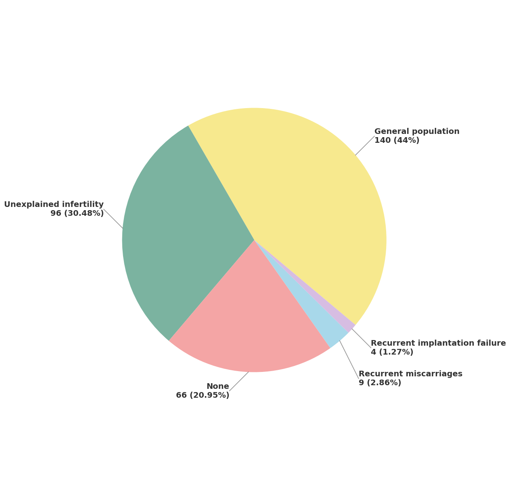
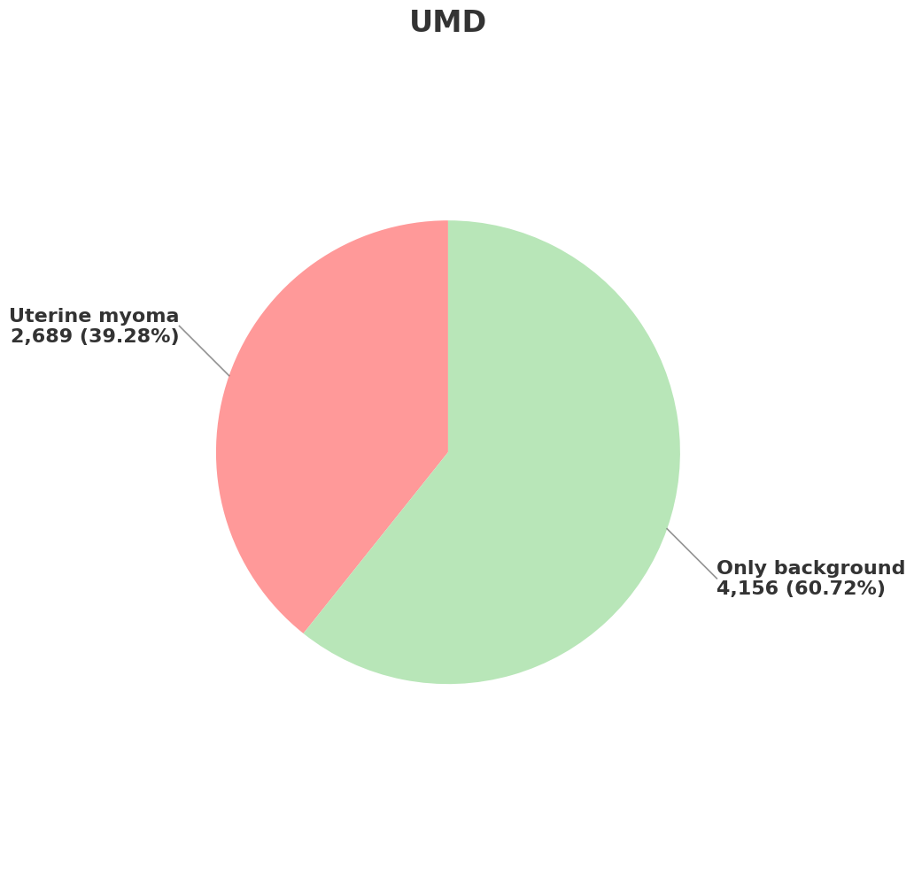
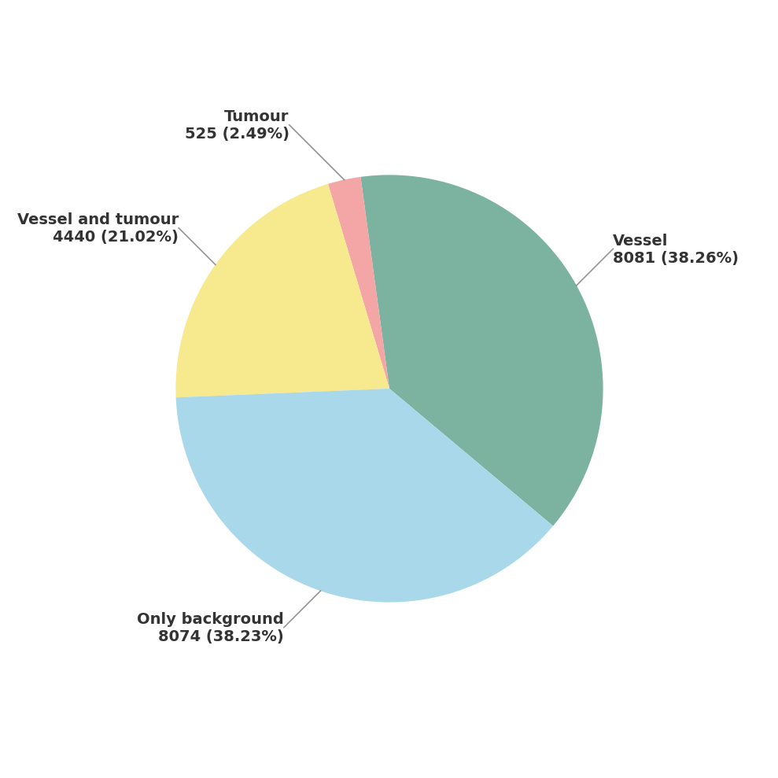
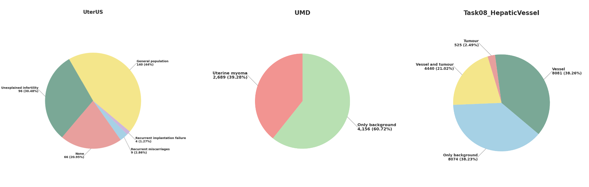

# SegTTA
This is the code repository for the paper:
> **SegTTA: Training-Free Test-Time Augmentation for Zero-Shot Medical Imaging Segmentation**
>
> Yihong Yao\*, Chunlei Li\*, Canxuan Gang\*, Wenzhi Hu\*, [Zeyu Zhang](https://steve-zeyu-zhang.github.io/)\*<sup>†</sup>, Hao Zhang, and Xiaoyan Li<sup>#</sup>
>
> \*Equal contribution. <sup>†</sup>Project lead. <sup>#</sup>Corresponding author.


## Citation

If you use any content of this repo for your work, please cite the following paper:
```
@misc{yao2025segtta,
  title={SegTTA: Training-Free Test-Time Augmentation for Zero-Shot Medical Imaging Segmentation},
  author={Yao, Yihong and Li, Chunlei and Gang, Canxuan and Hu, Wenzhi and Zhang, Zeyu and Zhang, Hao and Li, Xiaoyan},
  year={2025}
}
```

## Introduction

Foundation models for medical image segmentation, such as MedSAM2, exhibit strong zero-shot generalization across modalities and anatomy. Yet image quality varies considerably across clinical sites—driven by differences in equipment, acquisition protocols, and operators—causing performance gaps that are difficult to close without collecting new labeled data or retraining.

Test-time augmentation (TTA) addresses this by aggregating predictions from multiple augmented views of a test image at inference time, improving robustness without any parameter updates. However, standard TTA strategies designed for natural images do not account for the intensity distributions, noise sources, and boundary sensitivity that characterize CT, MRI, and ultrasound data.

We propose **SegTTA**, a training-free TTA framework tailored for medical segmentation. The method applies four augmentations that simulate realistic clinical variation—**Gamma correction**, **Contrast enhancement**, **Gaussian blur**, and **Gaussian noise**—to each test image, runs MedSAM2 independently on every augmented view, and fuses the resulting probability maps through a **confidence-weighted voting** algorithm with an adjustable threshold. No retraining or fine-tuning is required at any stage.

Experiments across three diverse segmentation tasks confirm consistent gains over individual MedSAM2 checkpoints:

- **UterUS** — 3D transvaginal ultrasound, endometrial cavity segmentation
- **UMD** — T2-weighted sagittal MRI, uterine myoma detection
- **HepaticVessel** — contrast-enhanced CT, hepatic vessels and tumors (multi-class)

Ablation studies reveal that large organs benefit most from intensity-based augmentations (Gamma, Contrast), while small lesions gain most from noise-based perturbations. The voting threshold offers a calibrated coverage–precision trade-off, enabling task-specific tuning for different clinical requirements.

<p float="left">
  
  
  
</p>

*Category distributions in UterUS (five clinical groups, 1.3%–44%), UMD (myoma vs. non-myoma slices, 39%–61%), and HepaticVessel (vessel, tumor, background, 2.5%–38.3%).*

---

## 🔧 Installation & Setup

SegTTA is implemented as a Google Colab notebook workflow. All experiments were conducted on **Google Colab** with an NVIDIA A100 GPU (80 GB), CUDA 12.4, and datasets accessed from **Google Drive**.

### 1. Clone MedSAM2 and install dependencies

Inside Colab, each notebook begins by cloning and installing MedSAM2 from source, then adding the medical imaging libraries it depends on:

```bash
%pip install -e .
!pip install medpy nibabel SimpleITK
```

### 2. Mount Google Drive

```python
from google.colab import drive
drive.mount('/content/drive')
```

### 3. Download MedSAM2 checkpoints

Checkpoints are downloaded from the [MedSAM2 HuggingFace repository](https://huggingface.co/wanglab/MedSAM2/) into a local `./checkpoints/` directory. The two primary checkpoints used in the published experiments are:

| Checkpoint | Used for |
|---|---|
| `MedSAM2_MRI_LiverLesion.pt` | UterUS (uterus segmentation) |
| `MedSAM2_US_Heart.pt` | UMD (myoma detection) and HepaticVessel |

Additional available checkpoints: `MedSAM2_2411.pt`, `MedSAM2_CTLesion.pt`, `MedSAM2_latest.pt`, `MedSAM2_generic.pt`.

### 4. Configure dataset paths

Each notebook contains a dedicated path-configuration cell. Set the Google Drive root directory and checkpoint path to match your own folder structure before running inference.

---

## 📁 Datasets

All datasets are stored in Google Drive and loaded through the notebook path configuration. Input volumes use the `.nii.gz` (NIfTI compressed) format.

### UterUS — 3D Transvaginal Ultrasound

Single-class semantic segmentation of the endometrial cavity from 3D transvaginal ultrasound volumes.

- **141** annotated scans with binary masks (174 unannotated volumes excluded)
- **Five clinical groups:** General population (44.0%), Unexplained infertility (30.5%), Uncategorized (21.0%), Recurrent miscarriage (2.9%), Recurrent implantation failure (1.3%)
- Tests robustness of large-structure boundary delineation under varying ultrasound quality

### UMD — T2-Weighted Sagittal MRI

Uterine myoma detection dataset covering nine FIGO myoma types and hybrid forms.

- **6,845** T2-weighted sagittal MRI slices from **300 patients**
- Pixel-wise annotations for four classes: uterine wall, uterine cavity, myoma, nabothian cyst
- **39.28%** of slices contain myomas; only myoma-containing slices are used (treated as single-class)
- Tests small-lesion recall in heterogeneous tissue backgrounds

### HepaticVessel — Contrast-Enhanced CT (Task08)

Multi-class segmentation of hepatic vessels and liver tumors from the Medical Segmentation Decathlon.

- **303** contrast-enhanced portal-venous CT volumes with vessel and tumor masks (training split)
- Three-class labels: vessel (38.3%), tumor (2.5%), background (38.2%)
- Tests structural continuity and multi-class delineation of fine tubular and connected vascular structures

<p align="center">
  
</p>

---

## 🏗️ Method Overview

SegTTA operates in three stages, requiring no model retraining at any point.

### Stage 1 — Baseline Inference

Each MedSAM2 checkpoint is applied directly to the original test volume using the video-predictor API with bidirectional frame propagation and bfloat16 mixed precision. This produces a set of baseline probability maps.

### Stage 2 — Test-Time Augmentation

Four augmentations simulate realistic sources of clinical image variability. Each is applied to the test image to produce a perturbed view, which is then segmented independently by MedSAM2:

- **Gamma correction** `I'(x,y) = (I/I_max)^γ · I_max` — models scanner calibration differences and global intensity shifts
- **Contrast enhancement** `I'(x,y) = αI + β` — captures protocol-driven tissue-to-background separability changes
- **Gaussian blur** — smoothing via Gaussian kernel convolution; emulates motion artifacts and reduced resolution
- **Gaussian noise** `I'(x,y) = I + N(0,σ²)` — reflects detector and reconstruction noise in low-dose CT and MRI

All stochastic augmentations use a fixed random seed (2024) to ensure reproducibility.

### Stage 3 — Confidence-Weighted Voting

All probability maps—baseline and augmented—are fused through a confidence-weighted voting algorithm with an adjustable threshold τ (default: **0.6**):

```
S(x,c) = Σ_k  w_k(x) · P_k(x,c),   where w_k(x) = max_c' P_k(x,c')

         argmax_c S(x,c)   if  max_c S(x,c) ≥ τ
ŷ(x) = {
         background         otherwise
```

Higher-confidence predictions receive proportionally larger weight. The threshold τ controls the coverage–precision trade-off: lower values favor complete region coverage; higher values enforce stricter boundary precision.

An optional minimal outlier cleaning step can follow, removing completely isolated single-voxel artifacts (zero neighbors in a 3×3×3 neighborhood) while preserving lesion structure.

---

## 🧪 Experiments

### Main Results

**UterUS and UMD — single-class segmentation**

| Model | UterUS IoU | UterUS Dice | UterUS HD95 | UMD IoU | UMD Dice | UMD HD95 |
|---|---|---|---|---|---|---|
| MedSAM2\_2411 | 78.67 | 87.05 | 32.12 | 78.75 | 85.64 | 21.95 |
| MedSAM2\_US\_Heart | 79.64 | 88.26 | 48.08 | 83.68 | 87.91 | 37.16 |
| MedSAM2\_MRI\_LiverLesion | 81.23 | 89.26 | 33.61 | 81.50 | 88.31 | 16.96 |
| MedSAM2\_CTLesion | 79.52 | 88.11 | 30.32 | 81.28 | 87.68 | **20.43** |
| MedSAM2\_latest | 77.85 | 86.65 | **23.56** | 79.08 | 85.60 | 24.55 |
| **SegTTA (Ours)** | **81.65** | **89.60** | 31.83 | **84.17** | **88.64** | 34.43 |

**HepaticVessel — multi-class segmentation**

| Model | mIoU | aIoU | mDice | aDice | HD95 |
|---|---|---|---|---|---|
| MedSAM2\_2411 | 73.99 | 79.97 | 80.45 | 87.73 | 29.48 |
| MedSAM2\_US\_Heart | 75.87 | 81.21 | 82.28 | **88.16** | 33.06 |
| MedSAM2\_MRI\_LiverLesion | 69.53 | 76.71 | 75.98 | 85.19 | 28.03 |
| MedSAM2\_CTLesion | 72.86 | 79.27 | 79.40 | 87.15 | 27.63 |
| MedSAM2\_latest | 66.40 | 72.46 | 73.58 | 81.42 | **27.14** |
| **SegTTA (Ours)** | **77.47** | **83.15** | **83.70** | **89.60** | 31.08 |

### Ablation: Augmentation Contributions

Each augmentation was removed one at a time to measure its individual contribution (vs. the best single-checkpoint baseline):

| Configuration | UterUS IoU | UterUS Dice | UterUS HD95 | UMD IoU | UMD Dice | UMD HD95 |
|---|---|---|---|---|---|---|
| Baseline | 81.23 | 89.26 | 33.61 | 83.68 | 87.91 | 37.16 |
| w/o Gamma correction | 76.54 | 86.14 | 25.08 | 82.53 | 86.89 | 34.20 |
| w/o Contrast enhancement | 76.64 | 86.18 | 25.00 | 82.21 | 86.65 | 33.89 |
| w/o Gaussian blur | 78.69 | 87.58 | 30.07 | 81.01 | 85.30 | 33.17 |
| w/o Gaussian noise | 77.01 | 86.46 | 25.97 | 77.73 | 82.94 | 28.56 |
| **Weighted Voting (0.6)** | **81.65** | **89.60** | **31.83** | **84.17** | **88.64** | **34.43** |

Key finding: intensity-based augmentations (Gamma, Contrast) are most critical for large-organ segmentation; Gaussian noise is most critical for small-lesion detection.

### Ablation: Voting Threshold Sensitivity

| Threshold | UterUS IoU | UterUS Dice | UterUS HD95 | UMD IoU | UMD Dice | UMD HD95 |
|---|---|---|---|---|---|---|
| 0.3 (lower) | 86.80 | 92.73 | 38.86 | 90.93 | 94.34 | 52.55 |
| **0.6 (default)** | **81.65** | **89.60** | **31.83** | **84.17** | **88.64** | **34.43** |
| 0.9 (higher) | 76.13 | 85.84 | 24.88 | 74.29 | 79.60 | 25.10 |

Lower thresholds maximize region coverage at the cost of boundary precision; higher thresholds sharpen boundaries at the cost of recall. τ = 0.6 provides the best overall balance.

---

## 💻 Inference & Evaluation Workflow

The full pipeline is notebook-driven. Both notebooks share the same ten-cell structure and recommended run order:

1. **Environment setup** — install MedSAM2 and dependencies, mount Google Drive, download checkpoints
2. **Path configuration** — set dataset root, checkpoint selection, and output directories
3. **Baseline inference** — run MedSAM2 on original volumes with bidirectional propagation; save probability maps and masks
4. **Metric computation & visualization** — compute IoU, Dice, HD95 per volume; visualize predictions against ground truth
5. **Augmentation generation** — apply Gamma correction, Contrast enhancement, Gaussian blur, and Gaussian noise; run MedSAM2 on each augmented view
6. **Voting-based fusion** — load all confidence maps, apply confidence-weighted voting with threshold τ
7. **Minimal outlier cleaning** — remove isolated single-voxel artifacts (optional)
8. **Final evaluation** — compute and aggregate mIoU, mDice, HD95 across all volumes
9. **Visualization** — generate confidence maps, per-image overlays, and summary plots

Results are written to:
- `performance_metrics.json` — aggregated metrics
- `detailed_segmentation_results.csv` — per-image breakdown
- `summary_report.txt` — human-readable summary

---

## 📓 Notebooks

| Notebook | Dataset | Primary Checkpoint |
|---|---|---|
| `SegTTA_UterUS.ipynb` | UterUS (3D transvaginal ultrasound) | `MedSAM2_MRI_LiverLesion.pt` |
| `SegTTA_UMD.ipynb` | UMD (T2-weighted sagittal MRI) | `MedSAM2_US_Heart.pt` |

**`SegTTA_UterUS.ipynb`** — End-to-end SegTTA pipeline for endometrial cavity segmentation from 3D ultrasound volumes. Demonstrates how intensity-based augmentations improve boundary delineation for large anatomical structures.

**`SegTTA_UMD.ipynb`** — Identical pipeline applied to uterine myoma detection from T2-weighted MRI slices. Demonstrates SegTTA performance on small, heterogeneous lesion targets where noise augmentation is most impactful.

Both notebooks are self-contained, designed for Google Colab with GPU acceleration, and use Google Drive for dataset and result storage.

---

For questions, contact [**xiaoyanli.qmh.offical@gmail.com**](mailto:xiaoyanli.qmh.offical@gmail.com).
